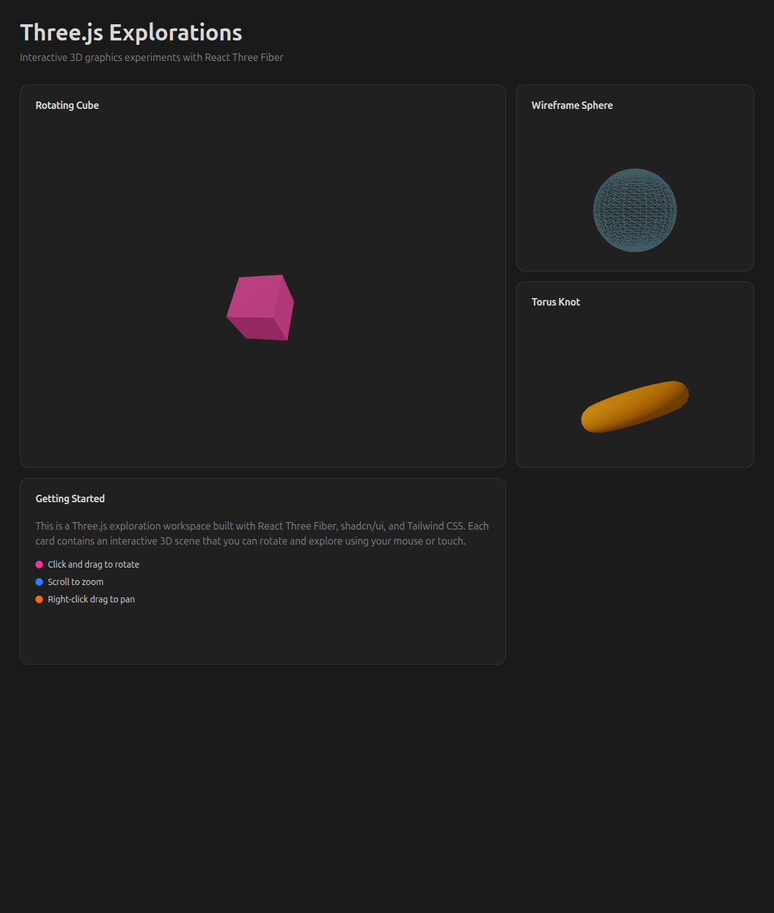

# Three.js Explorations

Interactive 3D graphics experiments built with **React Three Fiber**, **shadcn/ui**, and **Tailwind CSS v4**.



## 🎯 Overview

This project is a showcase of interactive 3D graphics in React, featuring a modern bento box grid layout with multiple Three.js scenes. Each scene demonstrates different 3D primitives and rendering techniques using React Three Fiber.

## ✨ Features

- **🎨 Bento Box Grid Layout** - Responsive card-based layout with varying sizes
- **🌑 Graphite Dark Theme** - Professional monochromatic theme from [tweakcn.com](https://tweakcn.com)
- **🎭 Interactive 3D Scenes**:
  - **Rotating Cube** - Pink cube with standard material
  - **Wireframe Sphere** - Light blue sphere with wireframe rendering
  - **Torus Knot** - Orange torus with smooth shading
- **🎮 OrbitControls** - Click/drag to rotate, scroll to zoom, right-click to pan
- **🧪 Unit Tests** - Vitest with ResizeObserver polyfill
- **📸 Playwright MCP** - Automated browser testing and screenshots

## 🛠️ Tech Stack

- **React 19** - Latest React with concurrent features
- **TypeScript 5.8** - Strict type safety
- **Vite 7.1** - Fast build tool and dev server
- **Three.js 0.180** - 3D graphics library
- **@react-three/fiber 9.4** - React renderer for Three.js
- **@react-three/drei 10.7** - Helper components and controls
- **Tailwind CSS 4.1** - Utility-first CSS framework
- **shadcn/ui** - High-quality React components
- **Vitest 3.2** - Fast unit testing framework
- **Bun** - Fast JavaScript runtime and package manager

## 🚀 Getting Started

### Prerequisites

- Node.js 18+ or Bun
- This is part of an Nx monorepo, so run commands from the workspace root

### Development Server

From the workspace root:

```bash
npx nx serve threejs_explorations
```

Or using Bun:

```bash
bunx nx serve threejs_explorations
```

The app will be available at **http://localhost:4200**

### Build

```bash
npx nx build threejs_explorations
```

Production build output: `apps/threejs_explorations/dist/`

### Testing

Run unit tests:
```bash
npx nx test threejs_explorations
```

Run tests in watch mode:
```bash
npx nx test threejs_explorations --watch
```

### Linting

```bash
npx nx lint threejs_explorations
```

### Type Checking

```bash
npx nx typecheck threejs_explorations
```

## 📁 Project Structure

```
threejs_explorations/
├── src/
│   ├── app/
│   │   ├── app.tsx              # Main app with bento grid layout
│   │   ├── app.spec.tsx         # Unit tests
│   │   └── app.module.css       # Component-specific styles
│   ├── components/
│   │   └── ui/                  # shadcn/ui components
│   │       └── card.tsx         # Card component
│   ├── lib/
│   │   └── utils.ts             # Utility functions
│   ├── assets/                  # Static assets
│   ├── styles.css               # Global styles & Tailwind config
│   ├── main.tsx                 # App entry point
│   └── test-setup.ts            # Test configuration & polyfills
├── public/                      # Public assets
├── index.html                   # HTML template
├── vite.config.ts               # Vite configuration
├── tailwind.config.js           # Tailwind CSS config
├── tsconfig.json                # TypeScript config
├── tsconfig.app.json            # App TypeScript config
└── package.json                 # Project dependencies
```

## 🎨 Customization

### Adding New 3D Scenes

1. Create a new component for your 3D object:

```tsx
function MyScene() {
  return (
    <mesh>
      <boxGeometry args={[1, 1, 1]} />
      <meshStandardMaterial color="purple" />
    </mesh>
  );
}
```

2. Add it to the grid in `app.tsx`:

```tsx
<Card className="overflow-hidden">
  <CardHeader>
    <CardTitle>My Scene</CardTitle>
  </CardHeader>
  <CardContent className="h-full">
    <Canvas camera={{ position: [0, 0, 5] }}>
      <ambientLight intensity={0.5} />
      <directionalLight position={[10, 10, 5]} />
      <MyScene />
      <OrbitControls />
    </Canvas>
  </CardContent>
</Card>
```

### Changing Themes

The Graphite theme colors are defined in `src/styles.css`. You can:

1. **Choose a different tweakcn theme**: Visit [tweakcn.com](https://tweakcn.com) and copy the theme variables
2. **Customize colors**: Edit the CSS variables in `:root` and `.dark` sections
3. **Switch to light mode**: Remove `class="dark"` from `index.html`

### Adding shadcn/ui Components

```bash
bunx shadcn@latest add button
bunx shadcn@latest add dialog
bunx shadcn@latest add dropdown-menu
```

## 🧪 Testing

### Test Setup

Tests use Vitest with jsdom environment. The test setup includes:

- **ResizeObserver polyfill** - Required for React Three Fiber
- **WebGL context mock** - Mocks HTMLCanvasElement.getContext for Three.js
- **React Testing Library** - For component testing

### Writing Tests

Example test for a new scene:

```tsx
import { render, screen } from '@testing-library/react';
import { BrowserRouter } from 'react-router-dom';
import App from './app';

it('should render my new scene', () => {
  render(
    <BrowserRouter>
      <App />
    </BrowserRouter>
  );
  expect(screen.getByText('My Scene')).toBeTruthy();
});
```

## 📸 Playwright MCP Integration

This project uses Playwright MCP for automated browser testing and screenshot capture.

### Taking Screenshots

```typescript
// Take full page screenshot
await page.screenshot({ fullPage: true });

// Take element screenshot
await page.locator('card').screenshot();
```

Screenshots are saved to: `/.playwright-mcp/`

## 🎓 Learning Resources

### Three.js & React Three Fiber
- [Three.js Documentation](https://threejs.org/docs/)
- [React Three Fiber Docs](https://docs.pmnd.rs/react-three-fiber)
- [Drei Components](https://github.com/pmndrs/drei)
- [Three.js Journey](https://threejs-journey.com/) - Excellent course

### shadcn/ui & Tailwind
- [shadcn/ui Documentation](https://ui.shadcn.com)
- [Tailwind CSS v4 Docs](https://tailwindcss.com)
- [tweakcn Theme Editor](https://tweakcn.com)

### WebGL & Graphics
- [WebGL Fundamentals](https://webglfundamentals.org/)
- [The Book of Shaders](https://thebookofshaders.com/)
- [Learn OpenGL](https://learnopengl.com/) - Concepts apply to WebGL

## 🚧 Future Experiments

Potential additions to this project:

- [ ] **Custom Shaders** - GLSL shader materials
- [ ] **Physics** - Integration with @react-three/cannon or @react-three/rapier
- [ ] **Post-processing** - Effects like bloom, depth of field
- [ ] **3D Models** - Load GLTF/GLB models
- [ ] **Animations** - Using @react-spring/three or useFrame
- [ ] **Particle Systems** - GPU-accelerated particles
- [ ] **VR Support** - WebXR integration
- [ ] **Performance Monitoring** - Stats and Leva controls

## 🤝 Contributing

This is a personal learning project, but suggestions and feedback are welcome!

## 📝 License

Part of the Full-Stack Web Development Experiments monorepo.

---

**Built with ❤️ using React Three Fiber, shadcn/ui, and Tailwind CSS**
